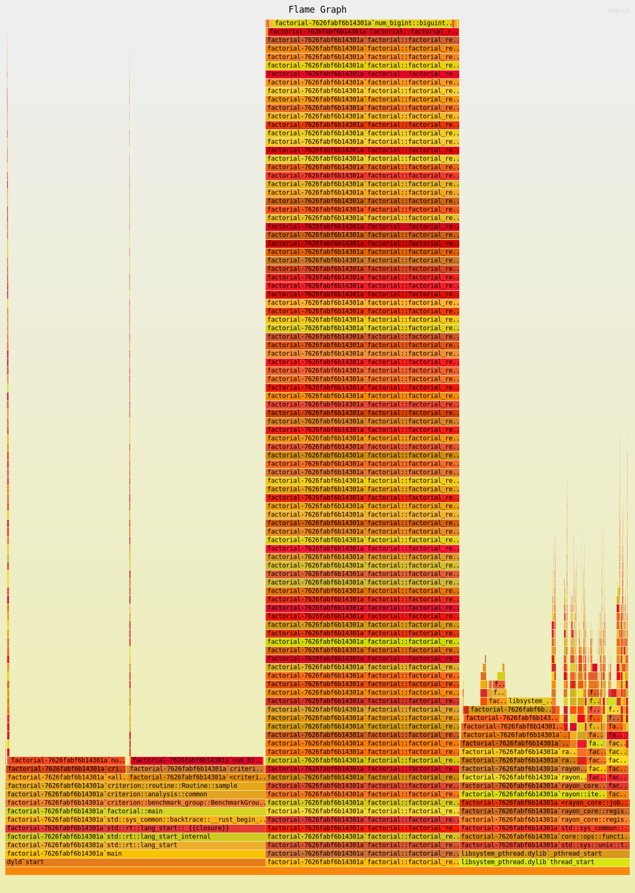

This repo contains some benchmarking experiments on simple functions.

# Factorial flamegraph
We provide two simple implementations for the factorial function, one of them iterative and one recursive.
We would expect to see that in the case of the recursive implementation, there are much more stack calls. Indeed, the flamegraph for the two factorial functions looks like this: 

